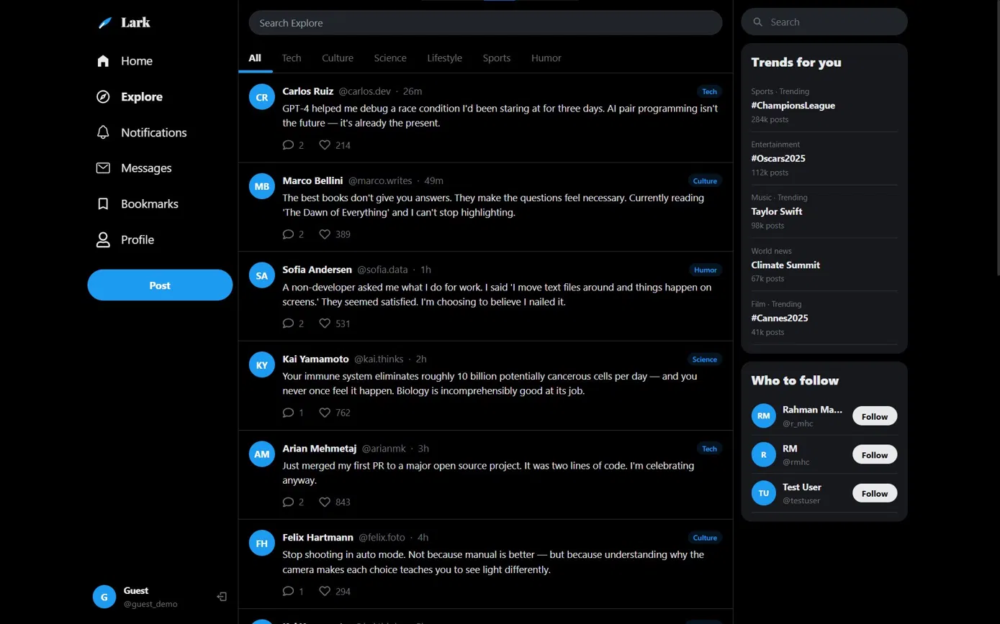

# LARK

## About

A full stack social media app 

## Live Demo

https://lark-social-media.onrender.com/

## Features

- **Responsive** — Optimised for all screen sizes
- **Guest Mode** — Explore the app instantly without creating an account
- **Posts** — Create, like, and comment on posts with optional image upload
- **Follow System** — Follow and unfollow users
- **Notifications** — Get notified on follows and likes
- **User Profiles** — Edit bio, profile picture and cover image
- **Image Upload** — Cloudinary powered image hosting

## Tech Stack

⚠️ Built as a portfolio project, not intended for commercial use

## License

MIT License
